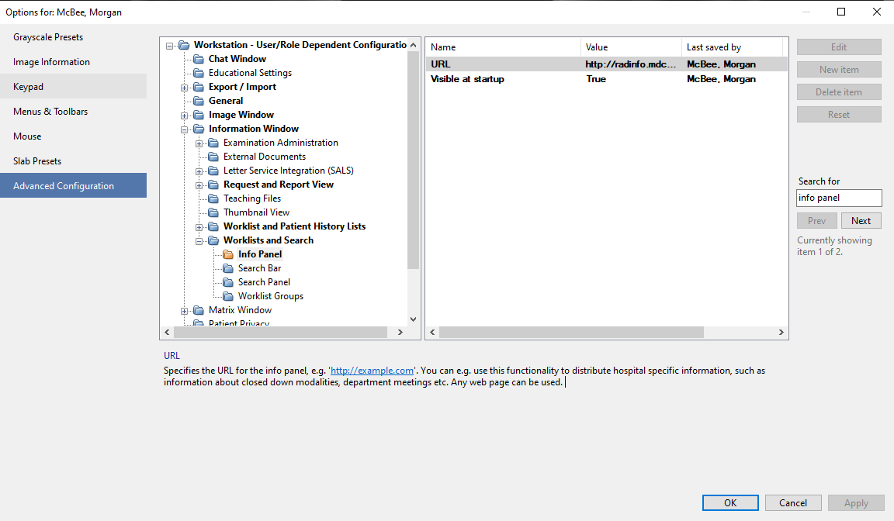

# Sectra Info Panel Links

A lightweight web page that surfaces frequently used Radiology resources (protocol libraries, on-call schedules, incident reporting, etc.) directly inside the **Info Panel** of Sectra PACS—or any other system that can embed an HTML page.

## Features

* **No backend** – pure HTML/CSS/JS served from any static host
* **Bootstrap 5** for layout and quick responsiveness
* **Bootstrap Icons** & **Lucide Icons** for a clean, modern look
* **Collapsible divisions** so radiologists can drill down to subspecialty resources without clutter
* Simple to customize: just edit `index.html` and update the placeholder URLs

---

## Features

* **No backend** (except for contact form) – pure HTML/CSS/JS served from any static host
* **Bootstrap 5** for responsive layout
* **Bootstrap Icons** & **Lucide Icons** for a clean, modern UI
* **Collapsible divisions** so radiologists can drill down to subspecialty resources without clutter
* Simple to **customize**: just edit `index.html` and update the placeholder URLs

---

## Quick Start

```bash
# Clone
git clone https://github.com/your-org/radiology-link-panel.git
cd radiology-link-panel

# (Option A) Preview locally
python -m http.server 8000   # then open http://localhost:8000/index.html

# (Option B) Deploy to any static host (e.g., GitHub Pages)
```

Embed the resulting URL in Sectra PACS → **Info Panel** settings (see below).

---

## Embedding in Sectra PACS (IDS7)

1. In IDS7, open **Options → Advanced Configuration**.
2. Expand **Information Windo → Worklists and Search → Info Panel**.
3. Select **URL** and paste the full address of your deployed `index.html` (e.g., `https://radiology.example.org/links/index.html`).
4. Click **Apply** and **OK**.



> The screenshot above shows exactly where the **URL** field lives inside the options tree.

---

## Customizing the Links

1. Open **`index.html`** in your favorite editor.
2. Replace each `https://example.com/...` placeholder with your institution’s real links.
3. Optionally remove or duplicate list items/divisions to match your workflow.
4. Save and refresh—no build step required.

---

## Link‑Request Form (`link-request.html`)

> **Important 📌 `link-request.html` is only a front‑end form stub.** You must add your own backend (email handler, ticketing endpoint, or serverless function) and set the form’s `action` attribute accordingly. Out of the box, the page does **not** send data anywhere.

---

## Icon Usage

### Bootstrap Icons

Bootstrap Icons are included via CDN:

```html
<link rel="stylesheet" href="https://cdn.jsdelivr.net/npm/bootstrap-icons@1.11.1/font/bootstrap-icons.css">
```

Insert an icon:

```html
<i class="bi bi-calendar3"></i>
```

Browse the full catalog at [https://icons.getbootstrap.com](https://icons.getbootstrap.com).

### Lucide Icons

Lucide provides a large selection of outline‑style icons and is loaded via CDN:

```html
<script src="https://unpkg.com/lucide@latest"></script>
```

Add icons in markup using the `data-lucide` attribute, optionally with a helper class for sizing:

```html
<i data-lucide="atom" class="lucide-icon me-1"></i>
```

At runtime, `sectra.js` runs:

```js
lucide.createIcons();
```

which converts every `data-lucide` element into an inline SVG. Full list: [https://lucide.dev](https://lucide.dev).

---

## Styling

* **`sectra.css`** contains **color** tokens tailored for dark‑mode interfaces (deep navy background, light text) but can be themed to match your brand.
* Bootstrap utility classes (e.g., `pt-2`, `text-light`) let you tweak layout quickly.

---

## Contributing

Pull requests are welcome—especially for:

* Accessibility improvements (ARIA labels, keyboard navigation)
* New division templates (e.g., Nuclear Medicine)
* Bug fixes in the JavaScript collapsible logic

---

## License

[MIT](LICENSE)
