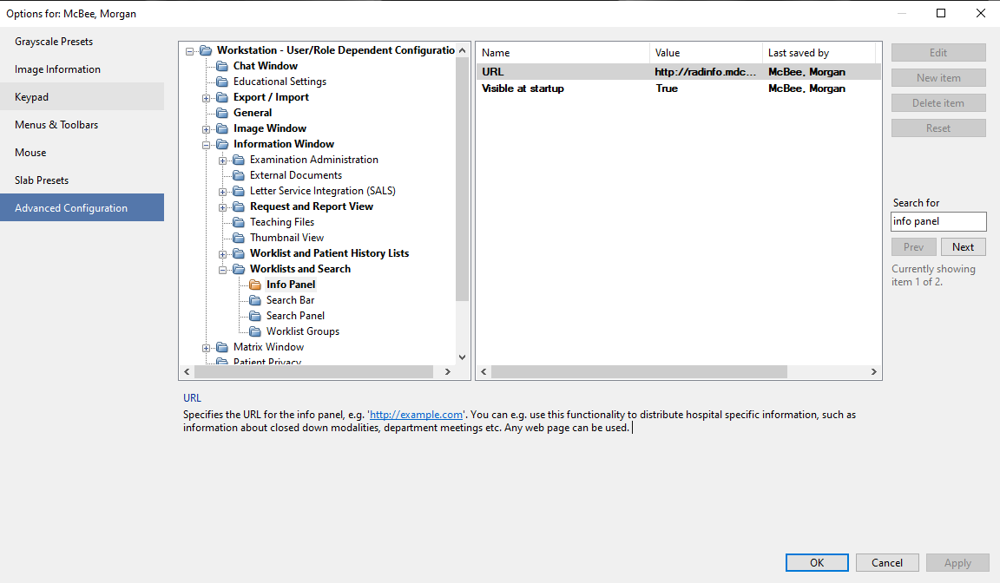

# Sectra Info Panel Links

A lightweight web page that surfaces frequently used Radiology resources (protocol libraries, on-call schedules, incident reporting, etc.) directly inside the **Info Panel** of Sectra PACS—or any other system that can embed an HTML page.

## Features

* **No backend** (except the optional link-request form handler) – pure HTML/CSS/JS served from any static host
* **No external dependencies** – Bootstrap, Bootstrap Icons, and Lucide are vendored, so nothing is fetched from a public CDN
* **Bootstrap 5** for responsive layout
* **Bootstrap Icons** & **Lucide Icons** for a clean, modern UI
* **Collapsible divisions** so radiologists can drill down to subspecialty resources without clutter
* Simple to **customize**: just edit `index.html` and update the placeholder URLs

---

## Quick Start

```bash
# Clone
git clone https://github.com/egeekial/sectra-info-panel-links.git
cd sectra-info-panel-links

# (Option A) Preview locally
python -m http.server 8000   # then open http://localhost:8000/index.html

# (Option B) Deploy to any static host (e.g., GitHub Pages)
```

Embed the resulting URL in Sectra PACS → **Info Panel** settings (see below).

---

## Embedding in Sectra PACS (IDS7)

1. In IDS7, open **Options → Advanced Configuration**.
2. Expand **Information Window → Worklists and Search → Info Panel**.
3. Select **URL** and paste the full address of your deployed `index.html` (e.g., `https://radiology.example.org/links/index.html`).
4. Click **Apply** and **OK**.



> The screenshot above shows exactly where the **URL** field lives inside the options tree.

---

## Customizing the Links

1. Open **`index.html`** in your favorite editor.
2. Replace each `https://example.com/...` placeholder with your institution’s real links.
3. Optionally remove or duplicate list items/divisions to match your workflow.
4. Save and refresh—no build step required.

---

## Link‑Request Form (`link-request.html`)

> **Important 📌 `link-request.html` is only a front‑end form stub.** You must add your own backend (email handler, ticketing endpoint, or serverless function) and set the form’s `action` attribute accordingly. Out of the box, the page does **not** send data anywhere.

---

## No External Dependencies

All scripts, stylesheets, and fonts are served from this repository's `vendor/` folder, so the page works on networks without internet access (for example, a hospital network with no route to public CDNs). The only external URLs in the page are the destination links themselves.

| Library | Version | Files |
|---|---|---|
| [Bootstrap](https://getbootstrap.com) | 5.3.3 | `vendor/bootstrap/bootstrap.min.css`, `vendor/bootstrap/bootstrap.bundle.min.js` |
| [Bootstrap Icons](https://icons.getbootstrap.com) | 1.11.1 | `vendor/bootstrap-icons/bootstrap-icons.min.css`, `vendor/bootstrap-icons/fonts/` |
| [Lucide](https://lucide.dev) | 1.50.0 | `vendor/lucide/lucide.min.js` |

The files were taken unmodified from the npm packages of those exact versions, apart from the trailing `sourceMappingURL` comment, which was removed because the `.map` files are not included. Each library's `LICENSE` sits next to its files.

To upgrade a library, replace its files in `vendor/` with the same files from the new version's npm package (for example, `npm pack bootstrap@<version>` and copy from `package/dist/`), then update the version numbers here and in the HTML comments.

---

## Icon Usage

### Bootstrap Icons

Bootstrap Icons are loaded from the vendored copy:

```html
<link rel="stylesheet" href="vendor/bootstrap-icons/bootstrap-icons.min.css">
```

The stylesheet loads its font files through the relative path `fonts/`, so keep `bootstrap-icons.min.css` and the `fonts/` folder together. If they are separated, the icons render as empty boxes.

Insert an icon:

```html
<i class="bi bi-calendar3"></i>
```

Browse the full catalog at [https://icons.getbootstrap.com](https://icons.getbootstrap.com).

### Lucide Icons

Lucide provides a large selection of outline‑style icons. The page uses a vendored copy pinned to **version 1.50.0** (the UMD build, `dist/umd/lucide.min.js`):

```html
<script src="vendor/lucide/lucide.min.js"></script>
```

This tag must come before `sectra.js` so the `lucide` global exists when it runs.

Add icons in markup using the `data-lucide` attribute, optionally with a helper class for sizing:

```html
<i data-lucide="atom" class="lucide-icon me-1"></i>
```

At runtime, `sectra.js` runs:

```js
lucide.createIcons();
```

which converts every `data-lucide` element into an inline SVG. Full list: [https://lucide.dev](https://lucide.dev).

To upgrade Lucide, check the current release with `npm view lucide version`, run `npm pack lucide@<version>`, copy `package/dist/umd/lucide.min.js` and `package/LICENSE` into `vendor/lucide/`, and update the version number in this README and in the comments next to the `<script>` tags in `index.html` and `link-request.html`. Icons are occasionally renamed between releases, so check that every `data-lucide` icon still renders.

---

## Styling

* **`sectra.css`** contains **color** tokens tailored for dark‑mode interfaces (deep navy background, light text) but can be themed to match your brand.
* Bootstrap utility classes (e.g., `pt-2`, `text-light`) let you tweak layout quickly.

---

## Usage Analytics (optional)

We used a self-hosted [Matomo](https://matomo.org) instance to measure link usage. If you add analytics, load the tracker script from your own internal Matomo server, not a public CDN, so the page stays free of external dependencies.

---

## License

[MIT](LICENSE)
